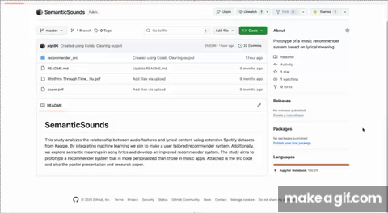

# SemanticSounds

This study analyzes the relationship between audio features and
lyrical content using extensive Spotify datasets from Kaggle. By integrating
machine learning we aim to make a user tailored recommender
system. Additionally, we explore semantic meanings in song lyrics
and develop an improved recommender system. The study aims to
prototype a recommender system that is more personalized than those
in music apps. Attached is the src code and also the poster presentation
and research paper. Below is the youtube video that explains project with demo.

)
